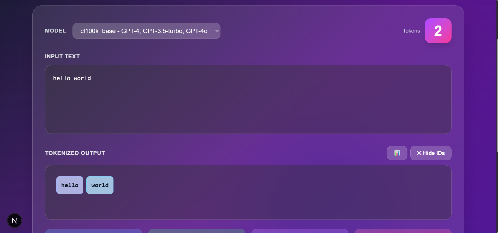

# 🎨 Token Visualizer

A beautiful, real-time tokenization visualizer for AI language models. See exactly how GPT models break down your text into tokens, with cost estimation and advanced analytics.


## 📸 Screenshots



> **Note**: To add your screenshot, take a screenshot of the app and save it as `public/screenshot.png`

## ✨ Features

- 🎯 **Real-time Tokenization** - See tokens update as you type
- 🎨 **Beautiful Dark UI** - Gradient backgrounds with glassmorphism effects
- 🤖 **Multiple Models** - Support for GPT-4, GPT-3.5, GPT-3, Codex, and GPT-2
- 📊 **Statistics Dashboard** - Character count, word count, token count, and cost estimation
- 💰 **Cost Calculator** - Estimate API costs before making calls
- 📋 **Copy to Clipboard** - Quick copy for text and token IDs
- 💾 **Export Data** - Download tokenization data as JSON
- 🎨 **Color-coded Tokens** - Each token gets a unique color for easy visualization
- ⚡ **Hover Effects** - Interactive token badges with smooth animations

## 🚀 Getting Started

### Prerequisites

- Node.js 18+ installed
- npm or yarn package manager

### Installation

1. Clone the repository:
```bash
git clone <your-repo-url>
cd tokention
```

2. Install dependencies:
```bash
npm install
```

3. Run the development server:
```bash
npm run dev
```

4. Open [http://localhost:3000](http://localhost:3000) in your browser

## 🎯 Usage

1. **Type or paste text** into the input area
2. **Select a model** from the dropdown to see how different encodings work
3. **View statistics** including character count, word count, tokens, and estimated cost
4. **Click on tokens** to see their individual IDs
5. **Export data** as JSON for further analysis
6. **Copy text or token IDs** to clipboard with one click

## 🧠 Supported Models

| Model | Description | Use Case |
|-------|-------------|----------|
| `cl100k_base` | GPT-4, GPT-3.5-turbo, GPT-4o | Most modern OpenAI models |
| `o200k_base` | GPT-4o (newer encoding) | Latest GPT-4o models |
| `p50k_base` | GPT-3 (Davinci, Curie) | Legacy GPT-3 models |
| `p50k_edit` | GPT-3 Edit models | Text editing tasks |
| `r50k_base` | Codex models | Code generation |
| `gpt2` | GPT-2 models | Older generation models |

## 💡 Why Use This?

- **Cost Optimization** - Know exactly how many tokens your prompts use before API calls
- **Prompt Engineering** - Understand how models see your text
- **Token Limits** - Stay within model context windows (4K, 8K, 32K, 128K tokens)
- **Debugging** - Identify unexpected tokenization in your prompts
- **Learning** - Understand how different models tokenize text differently

## 🛠️ Tech Stack

- **Framework**: Next.js 16.0
- **Language**: TypeScript
- **Styling**: Tailwind CSS
- **Tokenization**: js-tiktoken
- **Deployment**: Vercel (recommended)

## 📦 Project Structure

```
tokention/
├── app/
│   ├── page.tsx          # Main tokenizer component
│   ├── layout.tsx        # Root layout
│   └── globals.css       # Global styles
├── public/               # Static assets
├── package.json          # Dependencies
└── README.md            # This file
```

## 🎨 Customization

### Change Color Scheme

Edit the `colors` array in `app/page.tsx`:

```typescript
const colors = [
  'bg-indigo-200/80 border-indigo-300',
  'bg-sky-200/80 border-sky-300',
  // Add your own colors
];
```

### Adjust Cost Calculation

Modify the pricing in the `useEffect` hook:

```typescript
const inputCost = (tokenArray.length / 1000) * 0.03; // Change 0.03 to your rate
```

## 🚀 Deployment

### Deploy to Vercel

1. Push your code to GitHub
2. Import project in [Vercel](https://vercel.com)
3. Deploy with one click

### Deploy to Other Platforms

```bash
npm run build
npm start
```

## 📝 License

MIT License - feel free to use this project for personal or commercial purposes.

See [LICENSE](./LICENSE) for full details.

## 🤝 Contributing

Contributions are welcome! Please read our [Contributing Guide](./CONTRIBUTING.md) for details on:

- How to submit pull requests
- Code style guidelines
- Feature ideas and roadmap
- Bug reporting process

## 📸 Adding Screenshots

Want to add screenshots to your fork? Check out the [Screenshot Guide](./app/images/image.png) for tips on:

- Taking great screenshots
- Creating animated demos
- Best practices for documentation

## 📚 Documentation

- [README.md](./README.md) - Main documentation (you are here)
- [CONTRIBUTING.md](./CONTRIBUTING.md) - How to contribute
- [CHANGELOG.md](./CHANGELOG.md) - Version history
- [SCREENSHOT_GUIDE.md](./SCREENSHOT_GUIDE.md) - Screenshot instructions
- [PROJECT_FILES.md](./PROJECT_FILES.md) - Project structure overview
- [LICENSE](./LICENSE) - MIT License

## 🙏 Acknowledgments

- Built with [Next.js](https://nextjs.org)
- Tokenization by [js-tiktoken](https://github.com/dqbd/tiktoken)
- Styled with [Tailwind CSS](https://tailwindcss.com)
- Inspired by OpenAI's tokenizer tool

## 📧 Contact

Have questions or suggestions? Open an issue or reach out!

## ⭐ Show Your Support

If you find this project helpful, please consider:
- ⭐ Starring the repository
- 🐛 Reporting bugs
- 💡 Suggesting features
- 🤝 Contributing code
- 📢 Sharing with others

---

Made with ToodMind ❤️ using Next.js and Tiktoken
